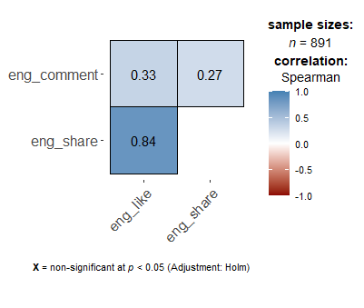
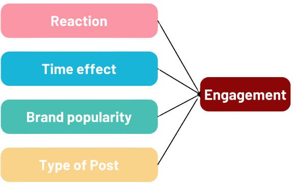
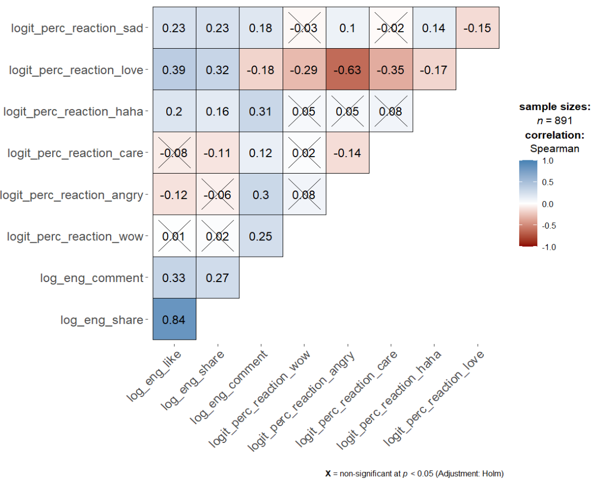
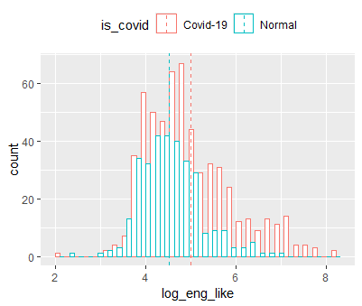
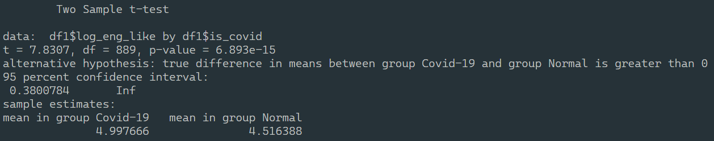
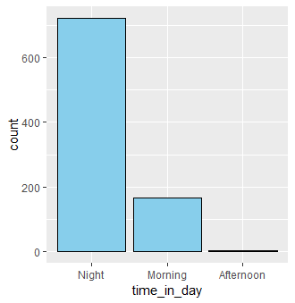
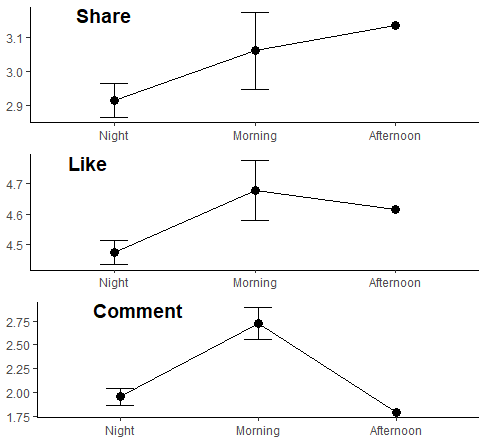
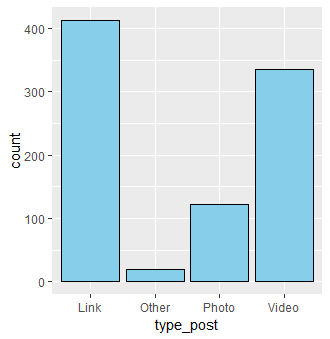
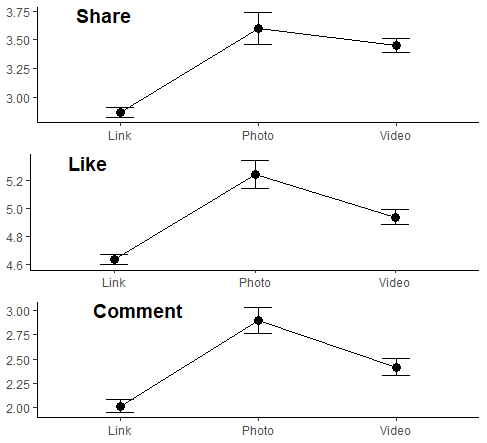

# Project Summary

## Table of Contents
1. [Project Background](#project-background)  
2. [Executive Summary](#executive-summary)  
3. [Insight Deep-Dive](#insight-deep-dive)  
   - [Performance of One-Way Routes](#performance-of-one-way-routes)  
   - [Performance of Aggregated Routes](#performance-of-aggregated-routes)  
   - [Performance of High Traffic](#performance-of-high-traffic)  
   - [Port Cancellation](#port-cancellation)  
   - [Historical Factors](#historical-factors)  
4. [Recommendations](#recommendations)  

---

## Project Background
Johnson & Johnson (JnJ) is a global leader in healthcare industry, operating in 3 main segments-pharmaceuticals, medical services, and consumer health products. The brand is known for its long history of innovation and strong global presence. Although J&J demonstrates an active presence on various social media platforms, the strategy they employed is relatively simple and fails to capture the recent movement.
  This analytics project investigated the key factors influencing Facebook post engagement, focusing on variables such as posting time, content type, brand popularity, and the presence of special emotion reactions.

---

## Executive Summary
A record of 891 posts ranging from Aug-2019 to Jul-2024 displays a sharp increase in engagement during the Covid-19 periods, though the figure returned to normal post-pandemic.
  Posting at different period of the day can return statistically difference results.
  Additionally, Link post-type generally underperformed, comparing to Video & Photo post-types.

---

## Insight Deep-Dive

### Post Engagement
A Facebook post engagement can be measured by *Like, Comment, Share,* and *Emotional reaction*. However, as the *Like* action requires the least friction for the audience. The analysis will treat the number of *Like* as the indicator for the post performance.

  

Furthermore, *Like* shows positive correlation with other indexes, especially *Share*.

We will further learn how the factors drive the engagement

  

### Reactions
- Majority of the reactions show a positive correlation with *Like*
- The associations, however, are weak, with only *Love* has the mild correlation of 0.39

  

### Covid-19
- Engagement during Covid-19 was higher, indicated by higher peak and mean

  

- Two-sample t-test suggests a 1.5 times statistical difference between the periods.

  

### Posting time
- Majority of posts are published during *Night* time

  

- However, Tukey's test results imply a statistically significant difference between *Night* and *Morning* under 90% level of confidence
- Although Afternoon time posts seem to return better result, the scarcity in number make the findings unreliable.

  

### Post type
- *Video* and *Link* are the most dominant post type during Covid period, with videos slightly ahead
- The pattern persisted post-Covid, but links have overtaken vidoes, and the gap has widened significantly

  

- To tailor a strategy closer to reality, we filtered out the Covid-19 period
- *Photos* and *Videos* generates more engagement across all three metrics
- Tukey's test results indicate that there is statistical difference between types of post, especially photo significantly outperforms the rest

  

---
## Recommendations
- Altering time posting schedule:
  - Migrating majority of posts from *Night* time to *Morning*
  - Experimenting with *Afternoon* time and revaluating the outcomes
- Adopting new strategy to follow current trends:
  - Only posting *Photos* and *Videos*: major media platforms are speculated to restraint the organic reach of posts that include **external link**
  - Educating and entertaining are the key areas for content to thrive
