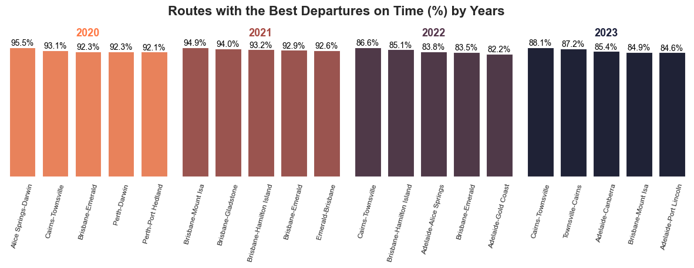
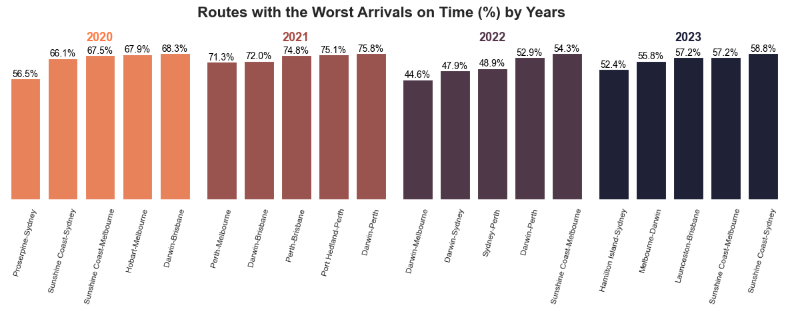
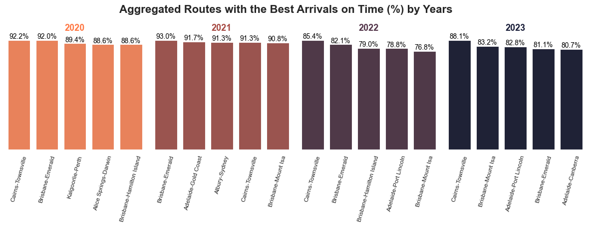
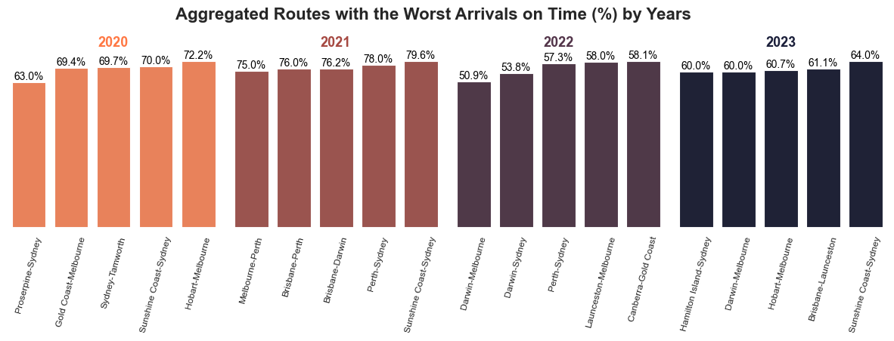
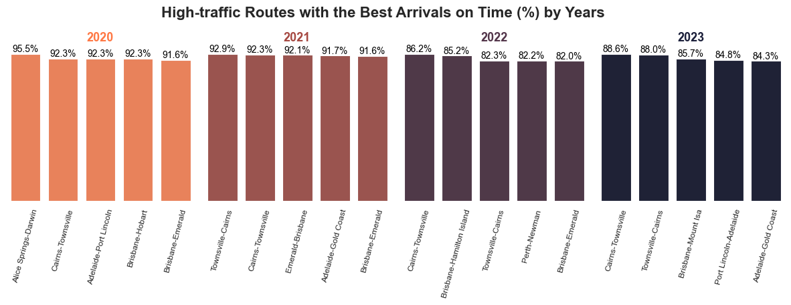
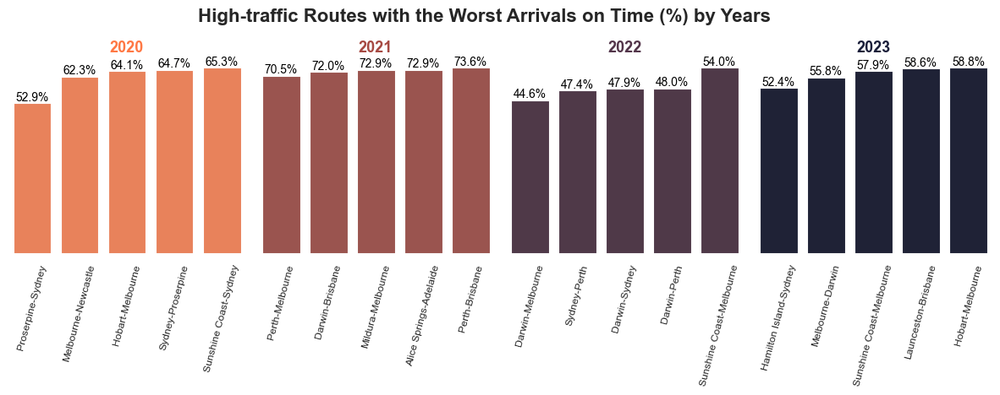
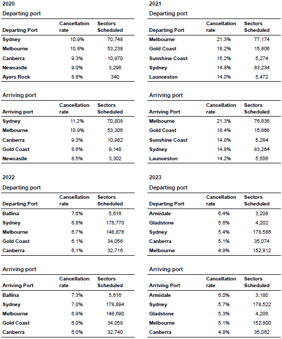
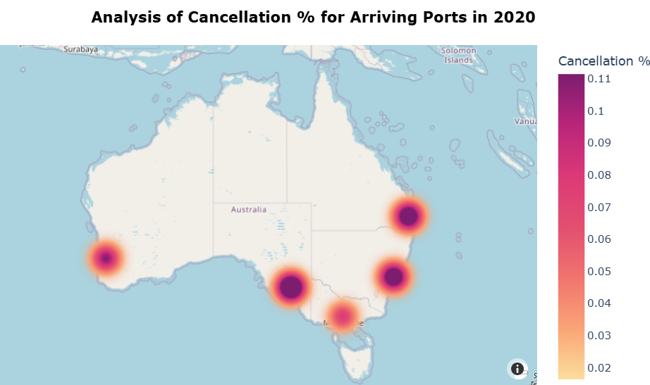

# Aviation Analysis

## Table of Contents
1. [Project Background](#project-background)  
2. [Executive Summary](#executive-summary)  
3. [Insight Deep-Dive](#insight-deep-dive)  
   - [Performance of One-Way Routes](#performance-of-one-way-routes)  
   - [Performance of Aggregated Routes](#performance-of-aggregated-routes)  
   - [Performance of High Traffic](#performance-of-high-traffic)  
   - [Port Cancellation](#port-cancellation)  
   - [Historical Factors](#historical-factors)  
4. [Recommendations](#recommendations)

---

## Project Background
The Australian air transport industry plays a vital role in connecting metropolitan cities and towns across the country. Our project analyses the flight records collected by Bureau of Infrastructure and Transport Research Economics (BITRE) to uncover the underlying patterns that airlines can leverage to streamline and improve their operations.

---

## Executive Summary
The aviation analysis of 20k records across 2020-2023 shows declines in cancellations and delays, indicating the industry stabilization post-pandemic. While small airports generally performed well, major airports like Sydney and Melbourne have displayed a significant variability in performance which could be attributed to the increasing of traffic.

---

## Insight Deep-Dive

### Performance of One-Way Routes
- The industry achieved its **peak on-time performance** in **2020**.  
- **2022** recorded the **worst performance**, primarily due to the **Covid-19 outbreak**.  
- Flights between **Townsville–Cairns** have **consistently delivered the best service**.  
- **Brisbane** is among the **most reliable departure airports**, with many flights achieving a **high on-time departure**

### Performance of Aggregated Routes
- **Best-performing routes** saw a slight decrease in performance over the four-year period, while **least-performing routes** showed a slight improvement, narrowing the gap between the two groups.  
- The trend is partly due to **aggregation of performance across both travel directions**.  
- **Notable stability in rankings** for routes where both directions performed well:  
  - Brisbane–Emerald maintained top rankings for arrival and departure in 2020–2021.  
  - Cairns–Townsville maintained top rankings in 2022–2023.  
- Underperforming departure routes in 2022 saw **no changes in membership**, only in ranking order.  
- **Consistent top performers** throughout the years: Cairns–Townsville and Brisbane–Emerald.  
- From 2022 to 2023, **Darwin–Melbourne, Darwin–Sydney, and Sydney–Perth** recorded **less than 50% of flights on time**, marking record-high delays => supports that **major capital city airports** (Darwin, Melbourne, Sydney) were the most significantly affected by the 2022 COVID-19 outbreak.  

### Performance of High Traffic
- **Consistent top performers**: Routes such as **Cairns–Townsville** and those involving **Adelaide** have maintained strong performance over four years, indicating operational efficiency and effective air traffic management.  
- **Consistent underperformers**: Long-haul routes involving major cities (**Darwin–Sydney**, **Darwin–Melbourne**, **Sydney–Perth**) have persistently recorded the **lowest on-time departure ratios**.  
- **Performance stability**: only **eight routes differing** in both the best- and worst-performing lists across years with performance remained consistent even under **high-traffic conditions** and only **marginal changes** in on-time performance values.  

### Port Cancellation
- **2020**: Major cities (**Sydney**, **Melbourne**, **Canberra**) recorded the **highest cancellation rates**, with **Sydney** leading in both arrivals and departures.  
- **COVID-19 impact**: **Melbourne**, **Gold Coast**, and **Sunshine Coast** experienced a surge in cancellations, linked to lockdowns in **NSW** and **Victoria** during the first half of 2020.  
- **2022**: Nationwide cancellations **declined** as state borders reopened.  
- **2023**: The downward trend continued, with smaller ports (**Armidale**, **Gladstone**) maintaining **low cancellation rates**.  
- Smaller ports demonstrate **greater stability** and **lower cancellations** compared to busy metropolitan airports like Melbourne and Sydney.  

### Historical Factors
- **Historical periods analysed (2010–2019)**:  
  - **Post-GFC recovery (2010–2012)** – Period following the 2008 Global Financial Crisis.  
  - **Economic stability (2013–2016)** – Stable global economy; notable event: disappearance of Malaysia Airlines Flight 370, prompting heightened aviation security.  
  - **Geopolitical friction (2017–2019)** – Growing geopolitical tensions, particularly between the US and China.  

- **On-time performance**:  
  - Consistent on-time performance between **60% and 94%** across one-way and high-traffic routes, 2010-2019.  
  - Smaller airports outperformed metropolitan hubs in both arrivals and departures — a trend still visible in 2020–2023. 

- **Cancellations**:  
  - High cancellation counts concentrated on major city routes, with **Sydney** recording over **50,000 cancellations**.  
  - Average cancellation rate ranged from **2% to 5%** during the decade.  
  - Best performers: smaller regional airports (**Karratha**, **Gladstone**, **Moranbah**, **Tamworth**).  
  - Peak pandemic (2020) saw cancellation rates surge to **20%**, but levels have since returned to pre-pandemic norms.  
  - COVID-19 exposed a **lack of readiness and emergency measures** at many airports.  

---

## Recommendations
- **Upgrade and expand major airport infrastructure**:  
  - Build new runways, aircraft bays, and terminals.  
  - Increase check-in counters and security lanes to reduce boarding times.  

- **Enhance air traffic control**:  
  - Collaborate with authorities to optimise flight paths and airspace usage.  
  - Leverage smaller ports to re-route traffic and reduce congestion.  
  - Provide regular training and upskilling for air traffic control personnel.  

- **Implement real-time monitoring and predictive analytics**:  
  - Track delays and cancellations to identify patterns and trends.  
  - Forecast passenger demand to optimise flight scheduling and reduce cancellations.  

- **Adopt emerging technologies**:  
  - Use **digital twins** to simulate and optimise airport operations.  
  - Explore **blockchain** and other digital tools to improve data-driven decision-making.  

